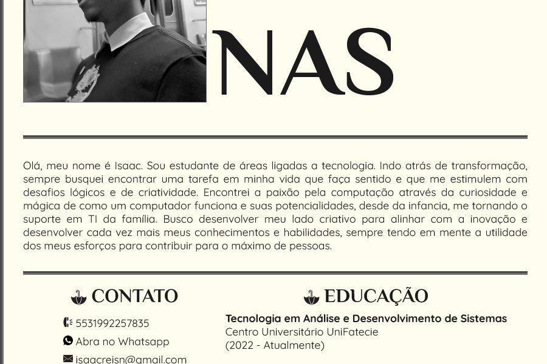

<h1 align="center">
  👤 Curriculum
</h1>

 

<h2 align="center"><a href="https://isaacnreis.github.io/curriculum/">Clique para visitar o projeto</a></h2>

---

## 👾 Tecnologias utilizadas

- HTML5
- CSS3
- JavaScript
- Visual Studio Code

---

## 🙋‍♂️👨‍💻 Pessoa Desenvolvedora

| [ Isaac N. Reis](https://github.com/isaacnreis) |
| :---: |

 
  
  
  
  

  

---